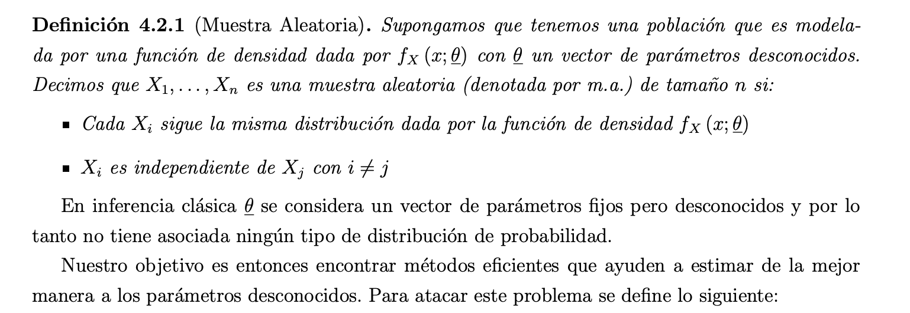
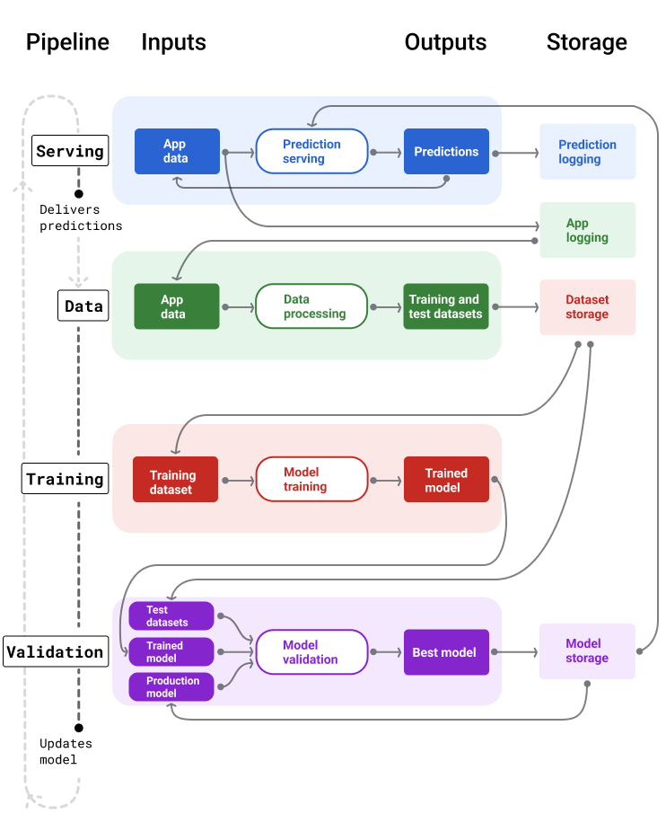

# Tarea 1

- [Tarea 1](#tarea-1)
  - [Teaorica](#teaorica)
    - [1. Investigue y anote las definiciones de los siguientes conceptos](#1-investigue-y-anote-las-definiciones-de-los-siguientes-conceptos)
    - [2. Investigue algunos tipos de bases de datos no relacionales](#2-investigue-algunos-tipos-de-bases-de-datos-no-relacionales)
    - [3. Investigue en qué consisten los siguientes conceptos](#3-investigue-en-qué-consisten-los-siguientes-conceptos)
  - [Práctica](#práctica)

## Teaorica
### 1. Investigue y anote las definiciones de los siguientes conceptos

Sea breve y conciso:

1. Muestra aleatoria.
   
   - [Referencia](https://www.dpye.iimas.unam.mx/soriano/Estadistica1_2021_2/sesion4.pdf)
   - [Referencia 2](https://www.dpye.iimas.unam.mx/soriano/Estadistica1_2021_2/NOTAS_3.pdf)
2. Base de datos.
   Una base de datos es una recopilación de datos sistemática y almacenada electrónicamente. Puede contener cualquier tipo de datos, incluidos palabras, números, imágenes, vídeos y archivos. Puede usar un software denominado sistema de administración de bases de datos (DBMS) para almacenar, recuperar y editar datos. En los sistemas informáticos, la palabra base de datos también puede referirse a cualquier DBMS, al sistema de base de datos o a una aplicación asociada con la base de datos.
    
   [Referencia](https://aws.amazon.com/es/what-is/database/)

3. Base de datos relacional.

    Las bases de datos relacionales almacenan datos en tablas con columnas y filas. Cada columna representa un atributo de datos específico y cada fila representa una instancia de esos datos.

    Se asigna a cada tabla una clave principal (una columna que la identifica de forma única). Esta clave se utiliza para establecer relaciones entre tablas. También se utiliza para relacionar filas entre tablas, como la clave externa de otra tabla.

    Una vez conectadas dos tablas, se obtienen datos de ambas con una sola consulta. Se escriben consultas SQL para interactuar con la base de datos relacional.
     
    [Referencia](https://aws.amazon.com/compare/the-difference-between-relational-and-non-relational-databases/)
4. Base de datos no relacionales.
    Existen diversos sistemas de bases de datos no relacionales debido a las variaciones en la forma en que gestionan y almacenan datos sin esquema. Los datos sin esquema se almacenan sin las restricciones que requieren las bases de datos relacionales.
     **Bases de datos de clave-valor** 
    Una base de datos clave-valor almacena datos como una colección de pares clave-valor. En cada par, la clave actúa como identificador único. Tanto las claves como los valores pueden ser cualquier cosa, desde objetos simples hasta objetos compuestos complejos.
     **Bases de datos de documentos** 
    Las bases de datos orientadas a documentos tienen el mismo formato de modelo de documento que los desarrolladores usan en el código de sus aplicaciones. Almacenan datos como objetos JSON flexibles, semiestructurados y jerárquicos.
     **Bases de datos gráficas** 
    Las bases de datos de grafos están diseñadas específicamente para almacenar y gestionar relaciones. Utilizan nodos para almacenar entidades de datos y aristas para almacenar relaciones entre entidades.

    Una arista siempre tiene un nodo inicial, un nodo final, un tipo y una dirección. Puede describir, por ejemplo, relaciones padre-hijo, acciones y propiedad.
5. Pipeline (en el contexto de machine learning).
   Las pipelines de Machine Learning organizan los pasos para compilar e implementar modelos en tareas bien definidas. Las pipelines tienen una de las siguientes dos funciones: entregar predicciones o actualizar el modelo.
   Las siguientes pipelines funcionan en conjunto para entrenar un modelo nuevo:

    - pipeline de datos. La pipeline de datos procesa los datos del usuario para crear conjuntos de datos de entrenamiento y prueba.
    - pipeline de entrenamiento. La pipeline de entrenamiento entrena modelos con los nuevos conjuntos de datos de entrenamiento de la pipeline de datos.
    - pipeline de validación La pipeline de validación valida el modelo entrenado comparándolo con el modelo de producción a través de conjuntos de datos de prueba generados por la pipeline de datos.
    
    [Referencia](https://developers.google.com/machine-learning/managing-ml-projects/pipelines?hl=es-419)
6. Tensor (en el contexto de machine learning).
    Los tensores son arreglos multidimensionales que pueden representar de manera natural datos y mapeos de múltiples dimensiones, desempeñando un papel central en el aprendizaje profundo moderno. De hecho, los bloques básicos de las redes neuronales profundas, como los núcleos de convolución multicanal y los bloques de atención, son esencialmente mapeos multidimensionales representados mediante tensores.
    [Referencia](https://www.sciencedirect.com/science/article/abs/pii/B9780323917728000211)
7. Token/tokenización (en el contexto de machine learning).
   Un token es un conjunto de caracteres que tiene un significado semántico para un modelo. La tokenización es el proceso de convertir las palabras de la instrucción en tokens.
   [Documentación](https://www.ibm.com/docs/en/watsonx/saas?topic=solutions-tokens)

### 2. Investigue algunos tipos de bases de datos no relacionales

Anote cómo funcionan,características, pros y contras, así como casos de uso en la vida real.

NOTA: Es importante mencionar que algunos gestores de Base de Datos pueden crear bases de datos de diferentes tipos, por ejemplo PostfresQL puede tener bases SQL, geoespaciales, vectoriales y timeseries. 

| Base de datos                                | Descripción                                                                                                                                                                      | Pros y Contras                                                                                                                                                                                                                                                                                                                                | Caso de Uso                                                                                                                                                                                                        |
| -------------------------------------------- | -------------------------------------------------------------------------------------------------------------------------------------------------------------------------------- | --------------------------------------------------------------------------------------------------------------------------------------------------------------------------------------------------------------------------------------------------------------------------------------------------------------------------------------------- | ------------------------------------------------------------------------------------------------------------------------------------------------------------------------------------------------------------------ |
| **Redis, Memcached** (en memoria)            | Bases de datos **clave-valor en memoria**. Redis soporta estructuras avanzadas (listas, hashes, sets), mientras que Memcached es más simple (solo caché).                        | **Pros:**   - Acceso extremadamente rápido (microsegundos).   - Ideal para caché y features online.   - Redis soporta persistencia opcional.   **Contras:**   - Limitadas por la RAM.   - No diseñadas para almacenamiento a largo plazo.                                                                                   | - Recomendaciones en tiempo real (Netflix usa Redis para perfiles).   - Cacheo de features en ML online.   - Sistemas de baja latencia como chats o gaming.                                                  |
| **MongoDB, CouchDB** (NoSQL documentales)    | Bases de datos **orientadas a documentos** (JSON/BSON). Flexibles para datos semiestructurados.                                                                                  | **Pros:**   - Muy flexibles, no requieren esquema fijo.   - Buen rendimiento para consultas dinámicas.   - Escalan horizontalmente.   **Contras:**   - No tan óptimas para transacciones complejas.   - Consumo de disco mayor que SQL.                                                                                     | - Almacenamiento de datos crudos para ML (imágenes con metadatos).   - Aplicaciones web con datos dinámicos (Uber usa MongoDB para geolocalización).   - Logs y datos de sensores antes de preprocesamiento. |
| **InfluxDB, Prometheus** (series temporales) | Bases de datos optimizadas para **series temporales** (datos con timestamp). Prometheus es más para monitoreo, InfluxDB para almacenamiento + análisis.                          | **Pros:**   - Altamente optimizadas para ingestión continua de datos.   - Consultas rápidas sobre métricas y tendencias.   - InfluxDB permite análisis complejos con SQL-like.   **Contras:**   - Especializadas: no sirven para datos genéricos.   - Escalar puede ser costoso (Prometheus no es distribuido nativamente). | - IoT y sensores (temperatura, energía).   - Entrenamiento de modelos predictivos de demanda/consumo.   - Monitoreo de MLops (perfiles de latencia, métricas de modelos).                                    |
| **Qdrant, Milvus** (vectoriales)             | Bases de datos diseñadas para **almacenar y buscar embeddings** (vectores de alta dimensión). Usan índices ANN (Approximate Nearest Neighbor) para búsqueda semántica eficiente. | **Pros:**   - Búsqueda semántica en segundos aunque haya millones de vectores.   - Escalables para RAG (Retrieval-Augmented Generation).   - Integración directa con LLMs.   **Contras:**   - Requieren embeddings generados por otro modelo.   - Nuevas → ecosistema menos maduro que SQL/NoSQL.                           | - Chatbots con memoria (OpenAI usa Milvus en proyectos de RAG).   - Buscadores semánticos (ej: búsqueda de imágenes similares en e-commerce).   - Detección de fraude con embeddings de transacciones.       |

[Chatgpt]
**Prompt**: Anote cómo funcionan,características, pros y contras, así como casos de uso en la vida real. |Base de datos| Descripción | Pros y Contras | Caso de Uso| |---|----|---|---| | Redis, Memcache | | | | | MongoDB, CouchDB | | | | | InfluxDB, Prometheus | | | | | Qdrant, milvus | | | |

### 3. Investigue en qué consisten los siguientes conceptos

Anote su importancia y utilidad en machine learning e inteligencia artificial.

1. Factorización LU
2. Factorización QR
3. Descomposición en valores singulares (SVD)
4. Descomposición en matrices

[http://personal.cimat.mx:8181/~alram/met_num/clases.html](http://personal.cimat.mx:8181/~alram/met_num/clases.html)

## Práctica

1. (Utilice el archivo grupos.csv). Se realizó un muestreo simple a la población estudiantil de una preparatoria. Se registró la altura de las personas (medida en metros). su género (**M** indica masculino, **F** femenino) y el grupo al que pertenecen (**A**,**B** o **C**).
Se desea conocer lo siguiente:

   - ¿La altura general se distribuye normal?
     > Respuesta
   - ¿La altura por género se distribuye normal?
     > Respuesta
   - ¿Existen diferencias significativas en la distribución de las alturas con respecto a los grupos?
     > Respuesta

1. (Utilice el archivo ingresos.csv). Un sociólogo quiere analizar si existe relación entre el sexo de las personas (**Hombre/Mujer**) y sus rangos de ingresos mensuales. Se tiene una muestra de trabajadores, y se desea saber si los ingresos son independientes del género. Si las variables no son independientes, comente a su criterio personal por qué sucede esto.
   > Respuesta:

1. (Utilice el archivo hipertension.csv) Se estudia a un grupo de pacientes con hipertensión, cuyas mediciones de presión sistólica estaban por encima de los 130 mmHg. Se registraron estos datos antes de un tratamiento experimental y posteriormente se registró si segu ́ıan teniendo niveles de presión sistólica altos después del tratamiento. Los datos indica 1 si el paciente presenta presión arterial alta, y cero si no. Queremos saber si el tratamiento tuvo efecto. (Hint: Utiliza la prueba de McNemar).
   > Respuesta:
1. (Utilice el archivo medias.csv) En una empresa de marketing se registraron las eda- des de los empleados de dos áreas distintas: Producción y Administración. Se quiere saber si existe diferencia significativa en la edad promedio de las áreas.
   > Respuesta:
1. (Utilice el archivo winequality-red.csv) Un laboratorio enológico analiza variables fisicoqu ́ımicas de diferentes vinos tintos. Se desea estudiar la relación entre la acidez volátil y la acidez fija. Se sospecha que no existe correlación lineal.
   > Respuesta:
